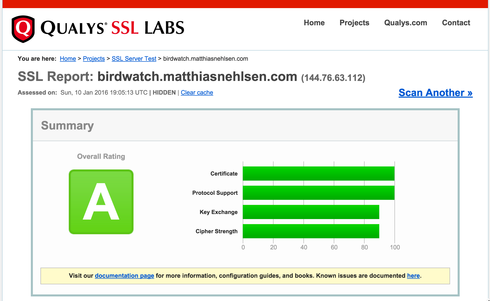

# Running Birdwatch with TLS

While it may not seem important to run a toy application such as this one over a secure connection, it surely is inevitable for any commercial system to make the transport between client and server as secure as possible. The **systems-toolbox** now offers support for TLS (including the WebSocket connection) through the **[systems-toolbox-sente](https://github.com/matthiasn/systems-toolbox-sente)** library.

However, in addition to obtaining a certificate and configuring a keystore, the JVM also needs to be configured properly by overriding a few security properties, as can be seen in the `birdwatch.security` file in this folder. These properties are then loaded in `project.clj` as follows:

    :jvm-opts ["-Xmx1G" "-server" "-Djdk.tls.ephemeralDHKeySize=2048"
               "-Djava.security.properties=TLS/birdwatch.security"]

The aforementioned override happens in `"-Djava.security.properties=TLS/birdwatch.security"`. Also, there's another property we want to set to ensure proper size of the ephemeral key used in **[Forward Secrecy](http://vincent.bernat.im/en/blog/2011-ssl-perfect-forward-secrecy.html)**: `"-Djdk.tls.ephemeralDHKeySize=2048"`.

Together, these measures give us an **A rating** in the **[Qualys® SSL Report](https://www.ssllabs.com/ssltest/analyze.html?d=birdwatch.matthiasnehlsen.com)**, which I have found very helpful when optimizing the secure transport layer in this application:

# Using a free certificate from Let's Encrypt

Creating a free & trustworthy certificate from **[Let's Encrypt](https://letsencrypt.org/)** was relatively straightforward. On my server, I ran the steps as described on their **[How It Works](https://letsencrypt.org/howitworks/)** page:

    $ git clone https://github.com/letsencrypt/letsencrypt
    $ cd letsencrypt
    $ ./letsencrypt-auto --help

Then, I ran the following:

    ./letsencrypt-auto certonly --standalone --standalone-supported-challenges \
    tls-sni-01 -d matthiasnehlsen.com -d birdwatch.matthiasnehlsen.com

This resulted in four different files, of which I only needed `privkey.pem` and `fullchain.pem`. Now the JVM cannot deal with these files directly, so I needed to convert them in two steps:

    openssl pkcs12 -inkey privkey.pem -in fullchain.pem -export -out mn.pkcs12
    keytool -importkeystore -srckeystore mn.pkcs12 -srcstoretype PKCS12 -destkeystore keystore.jks

The second command then generated the `keystore.jks` file, which is ready for use by this application. For that, I have stored it in the `./TLS/` folder. In order to start up the application, two to three environment variables are then needed:

    SSL_KEYSTORE=TLS/keystore.jks SSL_KEYSTORE_PW=<some-random-password> lein run

This will start the application with TLS enabled on port 8443. If you want a different port, you can also specify the `SSL_PORT`:

    SSL_KEYSTORE=TLS/keystore.jks SSL_KEYSTORE_PW=<some-random-password> SSL_PORT=9443 lein run

Obviously, you will also want to configure `iptables` or whatever you are using for port redirects if you want the application to respond on the normal https port 443.

# Possible improvements

While I'm quite happy with the **A rating**, I'd like to only use ciphers with **Forward Secrecy** enabled. However, I have not found a way to specify the ciphers directly, I have rather narrowed them down as much as possible. Another quite helpful tool in the process was **[TestSSLServer](http://www.bolet.org/TestSSLServer/)** and this reveals the following ciphers that are still available:

    $ java -jar TestSSLServer.jar localhost 9443
    Supported versions: TLSv1.2
    Deflate compression: no
    Supported cipher suites (ORDER IS NOT SIGNIFICANT):
      TLSv1.2
         TLS_RSA_WITH_AES_128_GCM_SHA256
         TLS_RSA_WITH_AES_256_GCM_SHA384
         TLS_DHE_RSA_WITH_AES_128_GCM_SHA256
         TLS_DHE_RSA_WITH_AES_256_GCM_SHA384
         TLS_ECDHE_RSA_WITH_AES_128_GCM_SHA256
         TLS_ECDHE_RSA_WITH_AES_256_GCM_SHA384
    ----------------------
    Server certificate(s):
      e374dcb389de9121bfdc38d8ace0b5bfadbeb602: CN=matthiasnehlsen.com
    ----------------------
    Minimal encryption strength:     strong encryption (96-bit or more)
    Achievable encryption strength:  strong encryption (96-bit or more)
    BEAST status: protected
    CRIME status: protected

If you have an idea how to disable `TLS_RSA_WITH_AES_128_GCM_SHA256` and `TLS_RSA_WITH_AES_256_GCM_SHA384`, please don't hesitate to submit a PR or otherwise get in touch.

Cheers