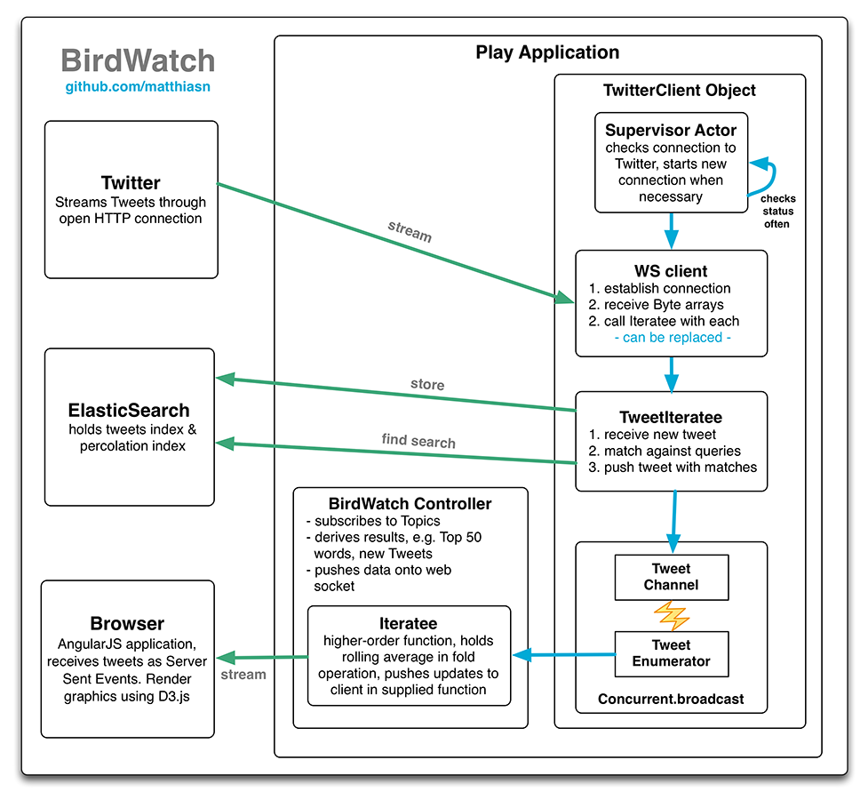

#**[Check out my Blog](http://matthiasnehlsen.com)**, more to come soon

#BirdWatch 

This is a dynamic web application for visualizing a constant stream of live Tweets as they occur. I call it BirdWatch. In the current version it generates a dynamic word cloud and a bar chart of the most frequent words within the last 1,000 Tweets. This web application is based on **[Play 2.1](http://www.playframework.com)**. I have written it for learning the concept of **[Iteratees](http://www.playframework.com/documentation/2.0.4/Iteratees)** in combination with consuming the **[Twitter Streaming API](https://dev.twitter.com/docs/streaming-apis)** and updating a single page web app using a **[WebSocket](http://tools.ietf.org/html/rfc6455)** connection. The visualization is done through the **[D3.js](http://d3js.org)** data visualization library. Tweets are persisted using **[MongoDB](http://www.mongodb.org)** and **[ReactiveMongo](http://reactivemongo.org)**, the reactive Scala driver for MongoDB. Large user profile images are downloaded from Twitter for each request and converted down to 80 * 80 pixels. This was done mostly to try out distributing such a task using actors and a round robin router. Also the Twitter thumbnails were a little too small with 48 * 48 pixels. 

Besides having plenty of fun with this project I am also working on my software development blog. I find that I learn best about problems when I try to explain them, which makes me excited about the blog idea. You can expect the blog to be up and running during the second quarter of 2013. Finally using Twitter myself, follow **[@_MNehlsen](https://twitter.com/_MNehlsen)** for updates on the blog. This project will get some minor updates before writing a blog post explaining how everything works. I will then start working on a redesigned distributed application for Tweet analysis taking into account the lessons learned. The architecture presented here serves its purpose but will most certainly not be ideal for all the ideas I had about Tweet stream analysis since I came up with this project. 

You can **[try BirdWatch](http://birdwatch.matthiasnehlsen.com)** without having to install anything. I run it on an Ubuntu server on port 9000 while forwarding port 80 to port 9000. In the event that this link is down you can also see BirdWatch in action in this **[video](https://www.dropbox.com/s/druqusd2nk8dw9j/IMG_6095.MOV)**.

The idea behind this reactive web app is to explore processing a live stream of information using Scala and the Play Framework (making use of Akka actors). A rolling window of Tweets is analyzed in terms of certain parameters and displayed graphically. The **[d3-cloud](https://github.com/jasondavies/d3-cloud)** project by Jason Davies is used for displaying the word cloud, adapted for dynamic updates as new data comes in through the WebSocket connection. Tweets are also stored within MongoDB. Storing the Tweets in a persistent data store allows pre-loading the 500 most recent Tweets when the page is loaded and will allow further analysis in the future.

###Setup

Twitter API consumer key and access token are required to consume the **[Twitter Streaming API](https://dev.twitter.com/docs/streaming-apis)**. Please **[create a Twitter application](https://dev.twitter.com/apps)** and store keys and secrets in a twitter.conf file, using the commented out section in the **[application.conf](https://github.com/matthiasn/BirdWatch/blob/master/conf/application.conf)** as a template. Please feel free to **[contact me](mailto:matthias.nehlsen@gmail.com)** if there are problems getting the application up and running. 

###Streaming API limitations 
Please be aware that only one connection to the Twitter Streaming API is possible from any one public IP address. Starting a connection to the Streaming API will potentially end other connections from the same network if NAT is in place using the same public IP address. Access from mobile networks is discouraged for the same reason.
 
###Architecture

The **[Twitter Streaming API](https://dev.twitter.com/docs/streaming-apis)** is used for subscribing to Tweets containing a search word. The stream is processed by an Iteratee which takes each chunk of data coming through the open HTTP connection, parses a Tweet and forwards it to the ImageProc supervisor for profile image retrieval (1), which forwards the message to the Image Retrieval Actor (2). This then starts asynchronous WS requests for the profile images (3). Once an image is retrieved, it is forwarded to a Round Robin router (4), which distributes the conversion over several image conversion actors (5). Once completed, the supervisor is notified with a "done" message (6), which then forwards the Tweet to database persistence (7a) and to the event bus (7b). The BirdWatch controller has subscribed to the event bus and gets notified with each new Tweet (8). This controller holds a rolling window of Tweets, performs some very basic statistical reasoning over this rolling window (word counts for word cloud, avg tweet length with standard deviation) and pushes information to the client using a WebSocket connection.       

Holding a rolling window of Tweets in memory might not scale well because it is kept and analyzed for each connection. Different options come to mind here:

*   Centralizing the rolling window by performing the reasoning within an actor, pushing results to event bus, having controller subscribe to these messages. This would scale well as there is not a lot of overhead for additional connections and calculations only need to be done once. The disadvantage would be that analysis could not easily be customized for each connection.

*   No state. Only push information about availability of new Tweets, let web client decide when to retrieve new data from a REST service, only perform reasoning on demand from the database on the client. Advantage: reasoning always over persisted data, no separate ways for in memory and for historic data. No in-memory state is lost upon server restart or crash.  The memory footprint would also be smaller compared to server-side analysis for each user. Any modern client can easily keep thousands of Tweets in memory and analyze these on the fly, which also allows for a much more reactive UI. Disadvantage: potentially many database queries (MongoDB performs well with proper indexing though and the cache hit rate will be high for current Tweets).

###Data Model

Tweets are stored directly into **[MongoDB](http://www.mongodb.org)**, without any intermediate case class modeling the Tweet because storing a representation of a Tweet in any form except in its entirety will almost always be wrong. Even if a perfect representation can be found for a particular point in time, it will fall short when previous data items were stored in a different format.

Mathematically speaking, let _A_ be the set with all the properties of an observable Tweet and _a_ be a positive integer with the cardinality of _A_ such that _a_ = | _A_ |.
Any case class that does not represent the entirety of the Tweet will be a member of the power set _P(A)_, combining only some of the properties / members of _A_. Now the cardinality of the power set _P_ grows large quickly: | _P_ | = 2^_a_, indicating that the chances of finding an ideal representation of the Tweet are slim at best. That being said, storage is cheap enough to allow storing the entirety of the Tweet within the database anyways.

Storing entire Tweets in the original **[JSON](https://tools.ietf.org/html/rfc4627)** string representation is certainly possible for example with **[Hadoop](http://hadoop.apache.org)**, but this approach falls short in terms of quick accessibility when trying to do (near) real-time reasoning over the data for immediate browser updates. A better way for this particular application seems to be parsing the JSON string into a **[JsValue](http://www.playframework.com/documentation/api/2.1.1/scala/index.html#play.api.libs.json.JsValue)** and storing it in its entirety within MongoDB. This way, the original data is preserved for further processing and can always be re-indexed according to the current needs of the application. Case classes can still be used for convenience within the application, but only after the entire Tweet has been stored. Any currently needed representation of the Tweet can then be changed as the need arises, while all past data also allows the conversion into the then current format.

The data model discussed above, storing the whole Tweet, is a work in progress; currently both the JSON representation and a (crippled) case class representation are stored in MongoDB. Later versions shall only store and process entire Tweets. 

###Going forward
The retrieval of the Tweets and the converted profile images and their persistence into MongoDB is an ongoing process, which potentially will not change much unless the Twitter data format changes. The part of the application that is reasoning over the stream of Tweets on the other hand will go through numerous recompilations in the further development lifecycle of this application. The connection to Twitter would be terminated and reestablished every time this happens, making the database coverage of the stream spotty. Running separate instances of this application in production and development environments would usually not be an option, as the Twitter Streaming API only allows exactly one connection for any IP address. 

The storage and persistence could and probably should be moved into a separate application running in another JVM in order to overcome this problem. **[Akka Remoting](http://doc.akka.io/docs/akka/snapshot/scala/remoting.html)** would allow to do this, where the persistence application uses a remote actor reference to inform the application serving the UI only when this app is actually running, while keeping the connection to Twitter open and storing Tweets and profile images with or without the processing application being reachable. Connecting two instances of Akka directly might be too tightly coupled in terms of application architecture though; my preferred way to go here would be the usage of some message-oriented middleware. An option might be **[RabbitMQ](http://www.rabbitmq.com)** connected through **[Camel](http://doc.akka.io/docs/akka/2.1.2/scala/camel.html)**. This would allow for persistence of messages when the Tweet processing / presenting app is not running, while the Twitter stream client / image processor does not need any knowledge of applications further processing the Tweets. Another option might be **[ZeroMQ](http://doc.akka.io/docs/akka/2.1.2/scala/zeromq.html)**, using a Publisher / Subscriber connection. Both options might be worth exploring to see which one fits the needs of the application better. ZeroMQ seems like the better fit in general.
 
Using message-oriented middleware with a publish-subscribe pattern for decoupling message ingestion and message analysis generally seems be a good pattern for reactive web applications doing event-stream processing. The middleware as an information broker allows production and development environments (potentially multiple development environments in a team) to run in parallel, without these environments knowing about each other or being affected by one another while at the same time not requiring to consume the event stream multiple times and independent of one another. In the Twitter example discussed here independent consumption of the Streaming API would not even work when separate instances of the application are all running behind the same public IP address. Completely separate development environments would also interfere with each other in terms database persistence unless each environment had a separate database. Separate databases would not allow to reason over the collected large amounts of data though. Therefore I suggest separating ingestion and data analysis and distribution. Data within the database is seen as immutable anyways as the Tweets will not change once they are stored.   

Another advantage of decoupling the application is that different parts of the application do not have to use the same technology and could be written in a different language. After all, there might be better options for graph processing in other languages than what is offered in Scala. The same goes for machine learning. Ideally, it should be possible to use the right tool for a job without being locked into a particular technology. ZeroMQ shines in this regard, with more than 30 languages being supported to date. 
  
#License

This software is distributed under the **[Apache License 2.0](http://www.apache.org/licenses/LICENSE-2.0)** (the "License"); you may not use this project except in compliance with the License. You may obtain a copy of the License at http://www.apache.org/licenses/LICENSE-2.0.

Unless required by applicable law or agreed to in writing, software distributed under the License is distributed on an "AS IS" BASIS, WITHOUT WARRANTIES OR CONDITIONS OF ANY KIND, either express or implied. See the License for the specific language governing permissions and limitations under the License.
