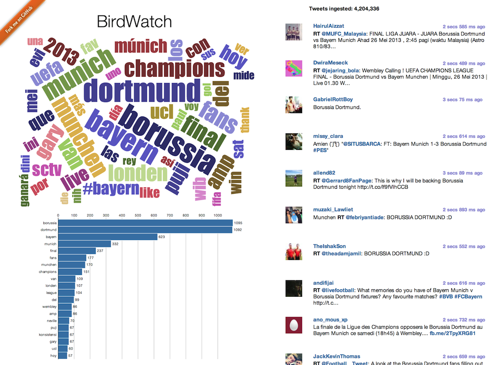

#BirdWatch  

This is a dynamic web application for visualizing a constant stream of live Tweets as they occur. I call it BirdWatch. This web application is based on **[Play 2.1](http://www.playframework.com)**. I have written it for trying out **[Iteratees](http://www.playframework.com/documentation/2.0.4/Iteratees)** in combination with consuming the **[Twitter Streaming API](https://dev.twitter.com/docs/streaming-apis)** and updating a single page web app using **[Server Sent Events](http://dev.w3.org/html5/eventsource/)**. The visualization is done through the **[D3.js](http://d3js.org)** data visualization library. Tweets are persisted using **[MongoDB](http://www.mongodb.org)** and **[ReactiveMongo](http://reactivemongo.org)**, the reactive Scala driver for MongoDB. 

The words in the word cloud and in the bar chart are clickable and allow you to drill further into the data by filtering to only Tweets that contain all words in the search string. This filter is also applied to Tweets coming in live. Clicking a word again that is already in your current selection will set the query to just that word. Just observe the address bar of your browser and you'll see how it works.

You can **[try BirdWatch](http://birdwatch.matthiasnehlsen.com)** without having to install anything. **[Check out my Blog](http://matthiasnehlsen.com)** for additional documentation on this project.

The idea behind this reactive web app is to explore processing a live stream of information using Scala and the Play Framework (making use of Akka actors). A rolling window of Tweets is analyzed in terms of certain parameters and displayed graphically. The **[d3-cloud](https://github.com/jasondavies/d3-cloud)** project by Jason Davies is used for displaying the word cloud, adapted for dynamic updates as new data comes in as **[Server Sent Events](http://dev.w3.org/html5/eventsource/)**. Tweets are also stored within MongoDB. Storing the Tweets in a persistent data store allows pre-loading a selection of the most recent Tweets when the page is loaded.

###Setup

Twitter API consumer key and access token are required to consume the **[Twitter Streaming API](https://dev.twitter.com/docs/streaming-apis)**. You need to **[create a Twitter application](https://dev.twitter.com/apps)** and store keys and secrets in a twitter.conf file, using the commented out section in the **[application.conf](https://github.com/matthiasn/BirdWatch/blob/master/conf/application.conf)** as a template. Please feel free to **[contact me](mailto:matthias.nehlsen@gmail.com)** if there are problems getting the application up and running. 

###Streaming API limitations 
Please be aware that only one connection to the Twitter Streaming API is possible from any one public IP address. Starting a connection to the Streaming API will potentially end other connections from the same network if **[NAT](http://en.wikipedia.org/wiki/Network_address_translation)** is in place using the same public IP address. Access from mobile networks is discouraged and most likely won't work.

## Licence

This software is licensed under the Apache 2 license, quoted below.

Copyright &copy; 2013 **[Matthias Nehlsen](http://www.matthiasnehlsen.com)**.

Licensed under the Apache License, Version 2.0 (the "License"); you may not use this project except in compliance with the License. You may obtain a copy of the License at http://www.apache.org/licenses/LICENSE-2.0.

Unless required by applicable law or agreed to in writing, software distributed under the License is distributed on an "AS IS" BASIS, WITHOUT WARRANTIES OR CONDITIONS OF ANY KIND, either express or implied. See the License for the specific language governing permissions and limitations under the License.