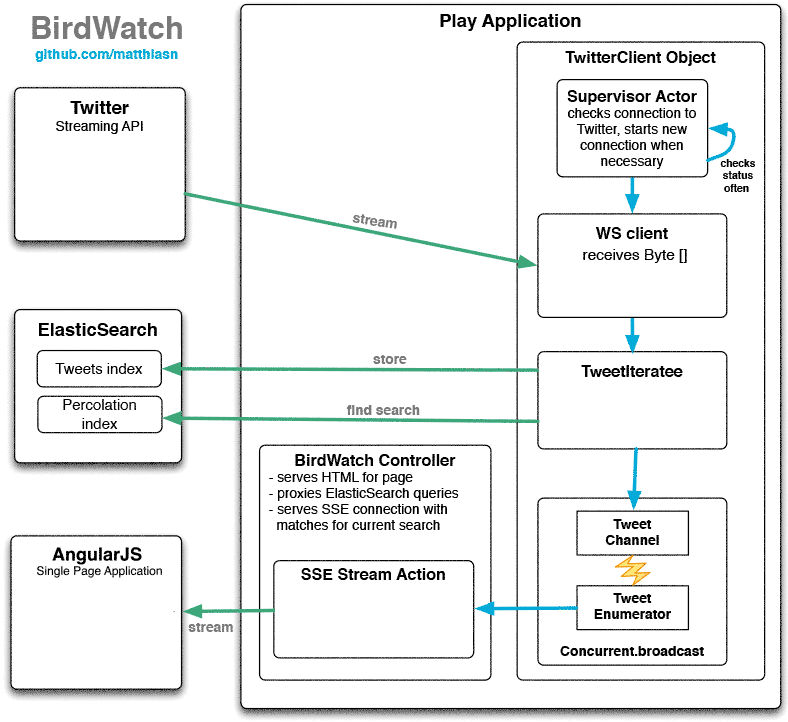

#BirdWatch  

BirdWatch is a reactive web application for visualizing a stream of live tweets making use of **[AngularJS](http://angularjs.org)**, **[BootStrap](http://getbootstrap.com)**, **[Crossfilter](http://square.github.io/crossfilter/)**, **[D3.js](http://d3js.org)**, **[ElasticSearch](http://www.elasticsearch.org)** and **[Play Framework](http://www.playframework.com)** (in alphabetical order).

**EDIT 04/2014:** To compare frameworks, there now also is a **[ReactJS](http://facebook.github.io/react/)** version available in addition to the AngularJS version. A detailed blog post will follow shortly. In this version there is a trend-aware bar chart built entirely with React, without relying on D3.js.

**EDIT 07/2014:** Now there also is a **[ClojureScript](https://github.com/clojure/clojurescript)** client available. Please see **[this blog article](http://matthiasnehlsen.com/blog/2014/07/17/BirdWatch-in-ClojureScript/)** and subsequent entries for more information on that client.

The **different clients** are located in the **clients/** folder, each of them **needs to be built in order to work**. Client build artifacts are no longer checked into the git repository in order to avoid bloating the repository size.

Here is an overview of the information flow within the system:

A Play application connects to the **[Twitter Streaming API](https://dev.twitter.com/docs/streaming-apis)** and receives all tweets that include at least one of a set of configured words. Twitter caps this at 1% of the FireHose, which basically means that the application will not receive more than one percent of all tweets at any given moment in time. This limit is still within the range of millions of tweets per day; a well-defined area of interest should comfortably fit in.
 
Incoming tweets are inserted into an **[ElasticSearch](http://www.elasticsearch.org)** index where they are almost instantly available for querying. Each tweet is also compared with what is called a percolation query, a pre-registered query for each connected client. Every query thus pre-registered is run on every new tweet. The client will immediately be informed of every tweet that matches the query by means of **[Server Sent Events (SSE)](http://dev.w3.org/html5/eventsource/)**. 

**[AngularJS](http://angularjs.org)** clients hold a local data copy of all the tweets they have asked for, using the 
**[ElasticSearch query syntax](http://www.elasticsearch.org/guide/reference/query-dsl/query-string-query/)**, with 'AND' being the default operator. Not only is every query run on the existing tweets in the ElasticSearch index but is also registered as a percolation query. A user-selectable amount of previous tweets is loaded and every new tweet for which the query matches is appended immediately, allowing tweets analysis in near-real-time. Queries are bookmarkable, which makes it easy to frequently look at interesting and potentially complex queries.

Client-side analysis of the (live) search result is performed using **[Crossfilter](http://square.github.io/crossfilter/)**.

A live version of this application is **[available](http://birdwatch.matthiasnehlsen.com)**. This instance listens to a bunch of software and data-related terms; see the application.conf file for details. Interesting queries on this data set include:

<a target="_blank" href="http://birdwatch.matthiasnehlsen.com/#/(job%20OR%20hiring)%20java"><strong>(job OR hiring) java</strong></a>

<a target="_blank" href="http://birdwatch.matthiasnehlsen.com/#/python%20-monty"><strong>python -monty</strong></a>

<a target="_blank" href="http://birdwatch.matthiasnehlsen.com/#/sql%20london)"><strong>sql london</strong></a>

Please feel free to contribute, pull requests will be happily accepted. I use this project to study the technologies involved and I would appreciate learning better ways of doing things.

A detailed description of the application can be found on my **[blog](http://matthiasnehlsen.com/blog/2013/09/10/birdwatch-explained/)**.

##Setup

Play Framework. You need a JVM on your machine. On a Mac the easiest way is to install **Play** using **[HomeBrew](http://brew.sh)**: 
 
    brew install play
    
If brew has already been installed on your machine, you will want to run the following first: 

    brew update
    brew upgrade

You will also need **ElasticSearch**:
 
    brew install elasticsearch

    
You then run

    elasticsearch

**BEWARE**: this application has recently been upgraded to work with ElasticSearch v1.0.0. There have been breaking changes in the Percolation Query API (for the better, for sure) and because of these changes, the latest version will not work with previous versions of ElasticSearch. If, for some reason, you cannot run v1.0.0 yet, you can check out an earlier commit of this application.
    
And inside the application folder:
    
    play run

Twitter API consumer key and access token are required to consume the **[Twitter Streaming API](https://dev.twitter.com/docs/streaming-apis)**. You need to **[create a Twitter application](https://dev.twitter.com/apps)** and store keys and secrets in a twitter.conf file, using the commented-out section in the **[application.conf](https://github.com/matthiasn/BirdWatch/blob/master/conf/application.conf)** as a template. 

That should be all there is to it before you can run your own instance listening on **[localhost:9000](http://localhost:9000)**. This will open the ReactJS version. For the AngularJS version open **[localhost:9000/angular/](http://localhost:9000/angular/)**

##Configuration
Inside `conf/application.conf` you can change the terms that the application subscribes to from the Twitter Streaming API. The application will then receive all tweets that contain one or more of the set of terms if the total number of tweets that match is no more than 1% of all tweets that Twitter receives at any given time. Otherwise, the delivery will be capped at 1%. You can also subscribe to tweets from a list of twitter IDs, either in addition to the terms or exclusively (in that case: `application.topics=""`).

You may want to remove Google Analytics script in main.scala.html or adapt the Analytics setting in the application.conf to suit your own needs.

###Streaming API limitations 
Please note that only one connection to the Twitter Streaming API is possible from any one public IP address. Starting a connection to the Streaming API will potentially end other connections from the same network if **[NAT](http://en.wikipedia.org/wiki/Network_address_translation)** is in place using the same public IP address. Access from mobile networks is discouraged and most likely won't work.

## Licence
Copyright © 2013 **[Matthias Nehlsen](http://www.matthiasnehlsen.com)**. Distributed under the **GNU GENERAL PUBLIC LICENSE**, Version 3. See separate LICENSE file.